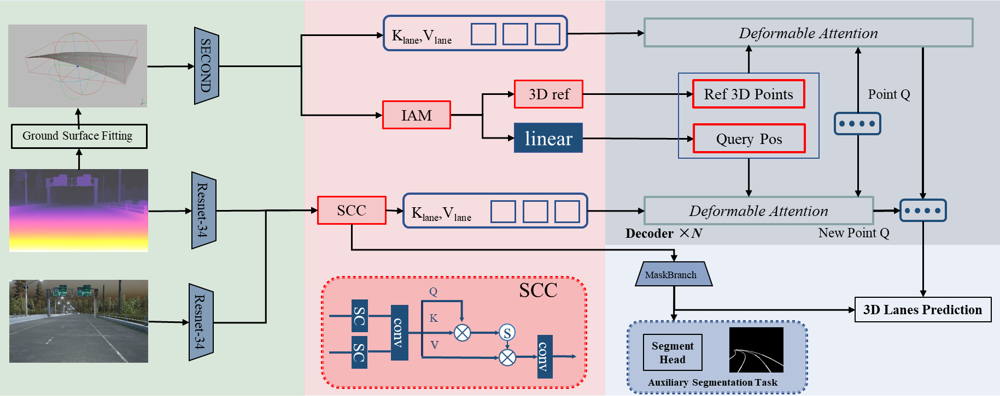

# GSF-3DLane
GSF-3DLane: Ground Surface Fitting for 3D Lane Detection Based on Monocular Depth Estimation 

## Introduction
The pseudo point cloud generated by depth estimation provides 3D spatial information for monocular 3D lane detection. However, due to the lack of disparity information, monocular images cause distortion in the pseudo point cloud. We find that these distortions mainly occur in the 3D representations of complex objects, while the point cloud of the 3D ground surface is less affected. Inspired by this observation, we introduce a ground surface fitting approach for the 3D lane detection model, GSF-3DLane. This model uses dynamic 3D Ground Surface Regions of Interest (3D Ground Surface ROI) to provide 3D spatial guidance for 3D lane lines, resulting in more accurate 3D lane detection. Specifically, we use a dual deformable attention mechanism based on a Query-Key pair constructed by our lane perception query generator and 3D Ground Surface ROI positional embedding to detect lane lines. On the one hand, the spatial compression cross-attention (SCC) integrates depth features into the front-view image, enhancing the depth spatial perception of the lane lines. On the other hand, the Dynamic 3D Frustum position encoding and 3D reference points provided by 3D Ground Surface ROI, which offer more accurate and unified 3D spatial features, are used for the dual deformable attention mechanism based on image and 3D representation. Experimental results demonstrate that GSF-3DLane significantly outperforms previous state-of-the-art methods on both the synthetic Apollo and real-world OpenLane datasets.
## Framework


3D pseudo point cloud generated from ground and depth images of point cloud.


# Usage

## Requirements
Python3
```
conda env remove --name gsf
conda create -n gsf python==3.7
conda activate gsf

pip install torch==1.8.0+cu101 torchvision==0.9.0+cu101  -f https://download.pytorch.org/whl/torch_stable.html


pip install pyyaml==6.0 tqdm==4.65.0 opencv-python==4.5.4.58 einops fvcore==0.1.5.post20221221 munkres==1.1.4
pip install mmcv-full==1.5.0 -f https://download.openmmlab.com/mmcv/dist/cu101/torch1.8.0/index.html
pip install mmdet==2.24.0 --index-url https://pypi.tuna.tsinghua.edu.cn/simple
pip install mmsegmentation==0.24.0 --index-url https://pypi.tuna.tsinghua.edu.cn/simple
pip install mmdet3d==1.0.0rc3 --index-url https://pypi.tuna.tsinghua.edu.cn/simple
pip install numpy==1.21.6  protobuf==3.19.4 ortools==9.3.10497  geffnet==1.0.2 tensorboardX ujson
pip install kornia==0.5.0
```
##  Code Structure
- `config/`: including configurations to conduct experiments.
- `option/`: including configurations to conduct experiments.
- `experiments/`: support for multi-GPU training.
- `data/`: the dataset class for 3dlane detection (Apollo and Openlane).
- `models/`: the implementation of GSF-3DLane model.
- `utils/`: evaluation tool.
- `main.py`: a python script to train.

## Data


We use [depth anything](https://github.com/LiheYoung/Depth-Anything) to obtain depth images.

## Pretrained Models

After finishing the organization, it will be updated later.


## Train
### Apollo
1. Balanced Scene
```
CUDA_VISIBLE_DEVICES='0,1,2,3' python -m torch.distributed.launch --nproc_per_node 4 main.py --config config/gsf/apollo_standard.py
```

2. Rare Subset
```
CUDA_VISIBLE_DEVICES='0,1,2,3' python -m torch.distributed.launch --nproc_per_node 4 main.py --config config/gsf/apollo_rare.py
```

3. Visual Variations
```
CUDA_VISIBLE_DEVICES='0,1,2,3' python -m torch.distributed.launch --nproc_per_node 4 main.py --config config/gsf/apollo_illu.py
```

### Openlane
```
CUDA_VISIBLE_DEVICES='0,1,2,3' python -m torch.distributed.launch --nproc_per_node 4 main.py --config config/gsf/openlane_1000_baseline.py
```

## Evaluation
### Apollo
1. Balanced Scene
```
CUDA_VISIBLE_DEVICES='0,1,2,3' python -m torch.distributed.launch --nproc_per_node 4 main.py --config config/gsf/apollo_standard.py --cfg-options evaluate=true eval_ckpt=apollo_standard.pth
```

2. Rare Subset
```
CUDA_VISIBLE_DEVICES='0,1,2,3' python -m torch.distributed.launch --nproc_per_node 4 main.py --config config/gsf/apollo_rare.py --cfg-options evaluate=true eval_ckpt=apollo_rare.pth
```

3. Visual Variations
```
CUDA_VISIBLE_DEVICES='0,1,2,3' python -m torch.distributed.launch --nproc_per_node 4 main.py --config config/gsf/apollo_illu.py --cfg-options evaluate=true eval_ckpt=apollo_illu.pth
```

### Openlane
```
CUDA_VISIBLE_DEVICES='0,1,2,3' python -m torch.distributed.launch --nproc_per_node 4 main.py --config config/gsf/openlane_1000_baseline.py --cfg-options evaluate=true eval_ckpt=openlane.pth
```
## Acknowledgement

This codebase is based on the following open-source projects. We thank their authors for making the source code publically available.
- [LATR: 3D Lane Detection from Monocular Images with Transformer](https://github.com/JMoonr/LATR)
- [Depth Anything: Unleashing the Power of Large-Scale Unlabeled Data](https://github.com/LiheYoung/Depth-Anything)
- [Depth Anything V2](https://github.com/DepthAnything/Depth-Anything-V2)
- [Pseudo-LiDAR from Visual Depth Estimation: Bridging the Gap in 3D Object Detection for Autonomous Driving](https://github.com/mileyan/pseudo_lidar)
-  [OpenLane](https://github.com/OpenDriveLab/PersFormer_3DLane)
-  [GenLaneNet](https://github.com/yuliangguo/Pytorch_Generalized_3D_Lane_Detection)
-  [mmdetection3d](https://github.com/open-mmlab/mmdetection3d)
-  [SparseInst](https://github.com/hustvl/SparseInst)

